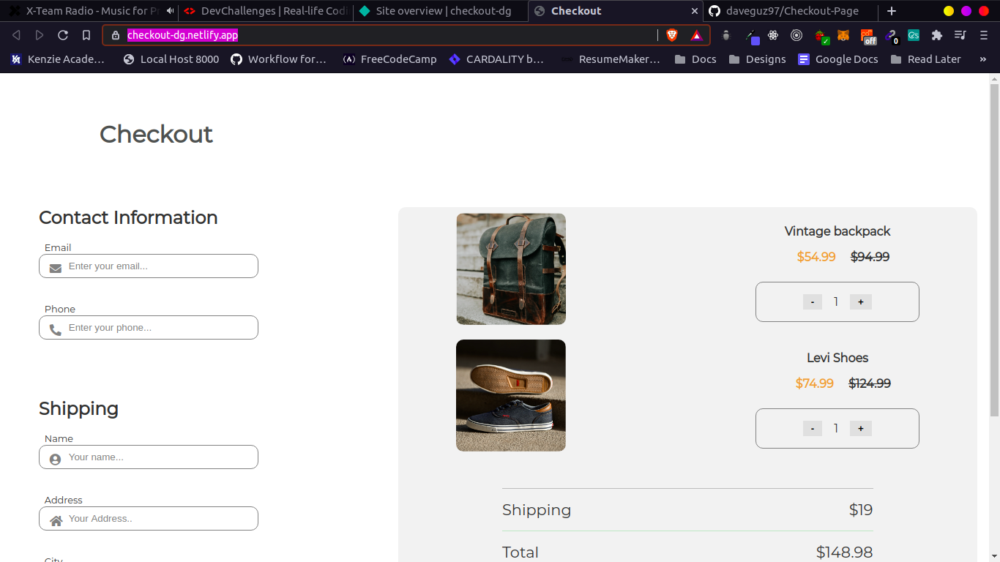

<!-- Please update value in the {}  -->

<h1 align="center">Checkout</h1>

<div align="center">
   Solution for a challenge from  <a href="http://devchallenges.io" target="_blank">Devchallenges.io</a>.
</div>

<div align="center">
  <h3>
    <a href="https://checkout-dg.netlify.app/">
      Demo
    </a>
    <span> | </span>
    <a href="https://github.com/daveguz97/Checkout-Page">
      Solution
    </a>
    <span> | </span>
    <a href="https://devchallenges.io/challenges/0J1NxxGhOUYVqihwegfO">
      Challenge
    </a>
  </h3>
</div>

<!-- TABLE OF CONTENTS -->

## Table of Contents

- [Clone this repository](#clone-this-repository)
- [Install dependencies](#install-dependencies)
  - [Contact](#contact)

<!-- OVERVIEW -->

## Overview




### Built With

<!-- This section should list any major frameworks that you built your project using. Here are a few examples.-->

- [SASS](https://sass-lang.com/)

## Features

<!-- List the features of your application or follow the template. Don't share the figma file here :) -->

This application/site was created as a submission to a [DevChallenges](https://devchallenges.io/challenges) challenge. The [challenge](https://devchallenges.io/challenges/0J1NxxGhOUYVqihwegfO) was to build an application to complete the given user stories.


## How To Use

To clone and run this application, you'll need [Git](https://git-scm.com) and [Node.js](https://nodejs.org/en/download/) (which comes with [npm](http://npmjs.com)) installed on your computer. From your command line:

```bash
# Clone this repository
$ git clone git@github.com:daveguz97/Checkout-Page.git

# Install dependencies
$ npm install
```

## Contact

- GitHub [@daveguz97](https://github.com/daveguz97)
- Twitter [@daveguz97](https://twitter.com/daveguz97)
